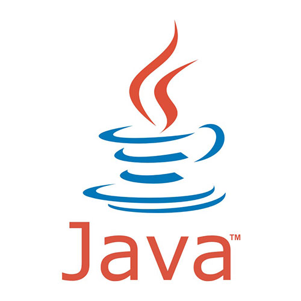

<h1 align="center">Hi 👋, I'm Gaya</h1>
<h3 align="center">A software developer</h3>

- 🔭 I’m currently developing the ultimate snake website.
- 🌱 I’m ~~currently~~ constatly learning. 
- 👯 I like working in a team as well as on my own
- 🤝 Looking to collaborate on web projects as a backend engineer (especially Java)
- 💃 Fun fact! I'm a dancer 

## :email: Find me on:

 

## 🧰 Languages and Tools:

 
